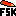
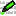

# FSK-Lab repository

blab blab bla bla bla bla 2

This project contains the PMM-Lab and FSK-Lab extension plugins to the data
analytics software KNIME (www.knime.org). They are developed at the Federal
Institute for Risk Assessment in Germany (BfR).

## FSK-Lab

FSK-Lab is an open source extension plugin to the Konstanz Information Miner
(KNIME). FSK-Lab enables KNIME users to work with FSK models within KNIME.

### Installation
FSK-Lab may be installed throught the update site <https://dl.bintray.com/silebat/fsklab>. More information about the installation can be found at the [Food Risk Labs website](https://foodrisklabs.bfr.bund.de/index.php/fsk-lab/)

### Nodes
-  FSK Creator
-  FSK Runner
-  FSK to R
-  FSKX Reader
-  FSKX Writer
-  FSK Editor
-  FSK to metadata

### Deprecated nodes
-  FSK Creator
-  FSKX Writer
-  FSKX Reader
-  FSK Runner
-  FSK Metadata Editor
-  FSK to R
-  FSK to metadata
-  FSK Editor
-  FSK Editor JS

### Project hierarchy
The project hierarchy is described in the [wiki](https://github.com/SiLeBAT/FSK-Lab/wiki/Project-hierarchy).

### Changelog
Changelog is available at [changelog.md](features/de.bund.bfr.knime.fsklab.feature/CHANGELOG.md).

## PMM-Lab

Predictive Microbial Modeling Lab (PMM-Lab) is an open source extension to the Konstanz Information Miner (KNIME). PMM-Lab aims to ease and standardize the statistical analysis of experimental microbial data and the development of predictive microbial models (PMM).

It consists of three components:
- a library of KNIME nodes (called PMM-Lab)
- a library of "standard" workflows
- a HSQL databaase to store experimental data and microbial models

### Installation
FSK-Lab may be installed throught the update site [https://dl.bintray.com/silebat/pmmlab]. More information about the installation can be found at the [Food Risk Labs website](https://foodrisklabs.bfr.bund.de/index.php/pmm-lab-installation/)

### Extension nodes
-  Converters
    +  XML To Table
-  Editors
    +  DB Data Deleter
    +  Data Creator
    +  Data Editor
    +  Formula Creator
    +  Model Creator
    +  Model Editor
-  Model Fitting
    +  Model Fitting
    +  PMM Joiner
-  Readers
    +  ComBase Reader
    +  Data Reader
    +  Formula Reader
    +  Model Reader
    +  NuML Reader
    + OpenFSMR Converter
    +  PMFX Reader
    +  SBML Reader
    + Variable Data Reader
    +  XLS Data Reader
    +  XLS Model Reader
-  Selectors & Viewers
    +  Data Selection
    +  Fitted Parameter View
    +  Predictor View
    +  Predictor View JS (deprecated)
    +  Primary Model Selection
    +  Secondary Model View
    +  Secondary Predictor View
    +  Tertiary Model Selection
-  Writers
    +  ComBase Writer
    +  Data Writer
    +  Formula Writer
    +  Model Writer
    +  PMFX Writer

### Eclipse plugin projects:
- *com.jgoodies*
- *com.thoughtworks.xstream*
- *de.bund.bfr.formats*
- *de.bund.bfr.knime.pmm.bfrdbiface.lib*
- *de.bund.bfr.knime.pmm.common*
- *de.bund.bfr.knime.pmm.nodes*
- *de.bund.bfr.knime.pmm.sbml.test*
- *de.bund.bfr.knime.pmm.target*
- *de.bund.bfr.knime.pmm.tests*
- *de.bund.bfr.knime.pmmlab.update.p2*
- *de.bund.bfr.knime.pmmlab.update.p2.deploy*
- *JSBML_PMF*
- *net.sf.jabref*
- *org.freixas.jcalendar*
- *org.javers*
- *org.jdom2*
- *PMM_FEAT*
- *quick.dbtable*

